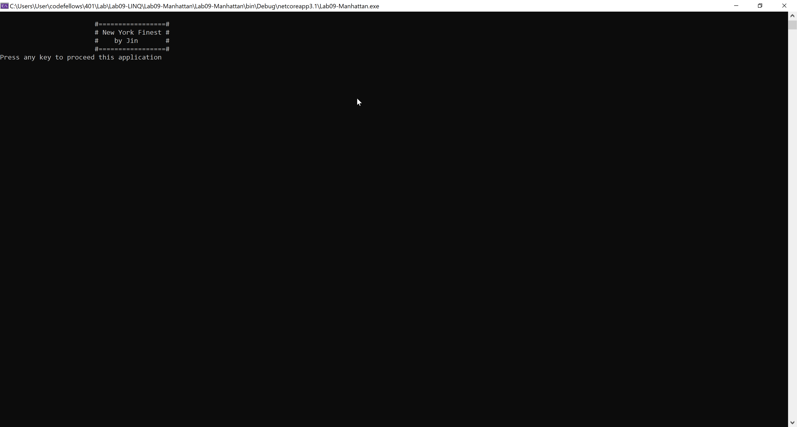
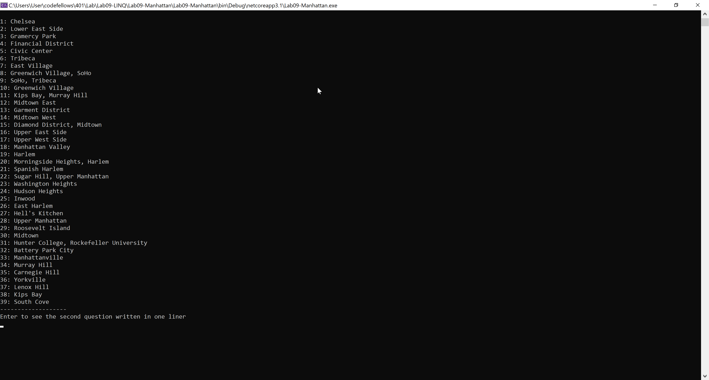
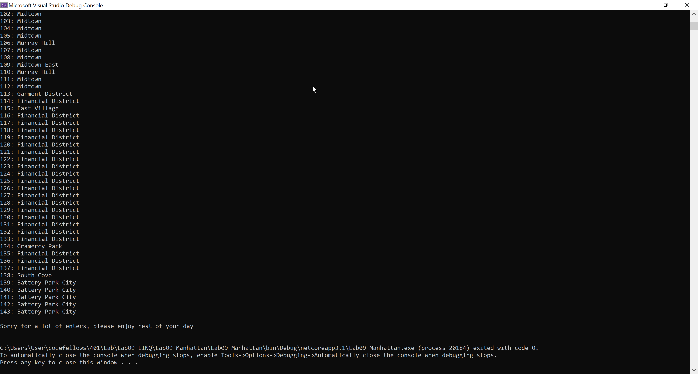

# Empire State of LINQ
----

Lab 9 - LINQ

*Author: Jin Kim*

----

## Description

This application is designed to illustrate the usage of LINQ and how to utilize NewtonSoft to parse the JSON file.

---
## Dependencies

- [NewtonSoft](https://www.newtonsoft.com/json/help/html/Introduction.htm)
- [Git](https://git-scm.com/)
- Terminal/ Command line
- [.Net Core SDK](https://dotnet.microsoft.com/download)
- [Visual Studio](https://docs.microsoft.com/en-us/visualstudio/releases/2019/release-notes)

---
### Getting Started
Clone this repository to your local machine using terminal(macOS), command line(Window).

```
$ git clone https://github.com/jinwoov/Lab09-LINQ.git
```

### To run the program from Visual Studio:
Select ```File``` -> ```Open``` -> ```Project/Solution```

Next navigate to the location you cloned the Repository.

Double click on the ```Lab09-LINQ``` directory.

In the `Lab09-LINQ`, navigate further into `Lab09-Manhattan`

Then select and open ```Lab09-Manhattan.sln```

---
### Visuals

#### Appliation Running


#### Functional Application


#### Application End


---

### Change Log
- 1.5: *Added try catch block* March 30 2020
- 1.4: *README is completed* March 29 2020
- 1.3: *Method is running and able to render correct amount of outputs* March 29 2020
- 1.2: *Added NuGet Package to implement Newtonsoft which is used to parse the JSON file* - March 29 2020
- 1.1: *Created classes that fits the JSON file content* - March 29 2020  
- 1.0: *Created Repo, structuralized the folder* - March 29 2020  